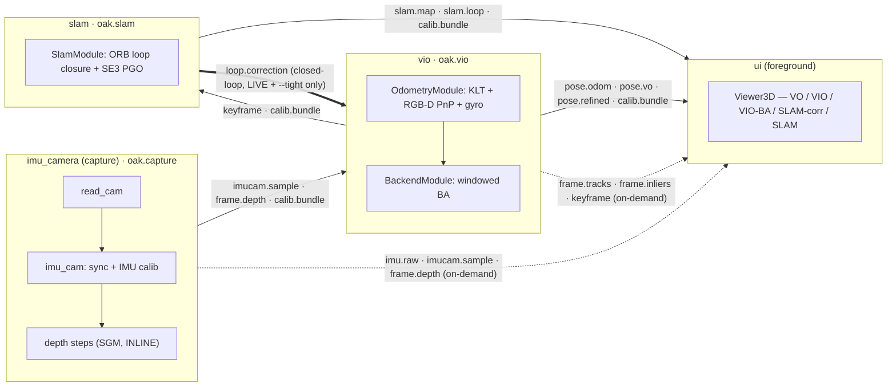

# Live Architecture — the 5-project split (4 live processes)

> **Status:** shipped. The single-process `ours/` monolith was split into FIVE
> independent projects (`imu_camera`, `depth`, `vio`, `slam`, `ui`) + a `launcher`
> + a `verification` harness. The DepthAI/Basalt reference (`baseline/`) is kept
> for ATE comparison. End-to-end byte-parity vs the pre-split baseline is
> `gap = 0`, verified live on a real OAK-D.
>
> **Runtime = 4 processes** (`imu_camera`, `vio`, `slam`, `ui`). Depth runs INLINE
> on the capture process's `imu_cam` thread, so the launcher never spawns a depth
> process; `depth/` is an independent SOURCE TREE, promotable to a 5th process via
> its own `depth.main` harness.
>
> The OFFLINE / replay byte-parity oracle is **in-process** (single `LocalPubSub`,
> no `IPCPubSub`) and lives in `verification/` — determinism + byte-identical
> output depend on it staying single-process. (The filename keeps the historical
> "PROC4" name; the architecture is the 5-project split.)

## 1. Motivation

The pre-split single-process live graph already worked, but it had three limits:

1. **One blow-up kills everything.** A Qt UI crash or a SLAM solver wedge took the
   whole pipeline down (incl. the device pipeline, which then tripped the OAK-D
   firmware watchdog and forced a USB replug).
2. **VIO and SLAM shared a Python interpreter** → still paid for incidental GIL
   sharing whenever a Python step in one of them ran. Moving the inner solve
   out-of-process only moved the inner solve; the reactive modules still ran in the
   main interpreter.
3. **Calibration / visualisation tools stole the device.** Every wizard first
   stopped the VIO source (the OAK-D is single-client) and reopened its own depthai
   pipeline. With a dedicated **capture** process (`imu_camera`) that owns the
   device forever, the wizards subscribe to its stream and never touch the link.

## 2. Process layout (the decisions)

Four long-lived processes, plus transient tool processes that come and go:

| Process      | Owns                                          | Subscribes (IPC)               | Publishes (IPC) |
|---           |---                                            |---                             |---|
| `imu_camera` | OAK-D device + cam/IMU sync + IMU calib + **inline SGM depth** | —              | `cam.sync`, `imu.raw`, `imucam.sample`, `frame.depth`, `calib.bundle` |
| `vio`        | RGB-D PnP odometry + windowed BA              | `imucam.sample`, `frame.depth`, `calib.bundle`; **`loop.correction` from `slam` (LIVE + `--tight` only — closed-loop)** | `pose.odom`, `pose.vo` (pure-vision, LIVE-only), `keyframe`, `frame.tracks`, `frame.inliers`, `pose.refined` **and** `ba.window` (windowed-BA solve snapshot for the BA Window, opt-in `--ba-window`) |
| `slam`       | ORB loop closure + SE(3) pose graph          | `keyframe`, `calib.bundle` (from VIO) | `loop.correction` (loop-event rewrite), `slam.map` (continuous keyframe overlay, LIVE-only) **and** `slam.loop` (per-candidate loop-match funnel for the Loop-Closure window, LIVE-only) |
| `ui`         | Qt `MainWindow`, single 5-trajectory Viewer3D + View/Visualize/Calibration menus | `pose.odom`, `pose.vo`, `pose.refined`, `calib.bundle` (vio); `slam.map`, `slam.loop`, `calib.bundle` (slam); on-demand: `imucam.sample`, `frame.depth`, `imu.raw` (capture) + `frame.tracks`, `frame.inliers`, `keyframe`, `ba.window` (vio, BA Window opt-in) | — (sink) |

> The capture process is named `imu_camera`; its endpoint is `oak.capture` and its
> entrypoint is `imu_camera.main`. Throughout this doc "capture" = `imu_camera`.



The UI's Visualize / Calibration windows are **not** separate transient processes:
they run **in the UI process** as plain child `QMainWindow` / modal dialogs, fed
over IPC by the adapters in `ui/modules/ipc_sources.py` (see §6). Each adapter opens
its own read-only `IPCPubSub(role="client")` subscription on demand and tears it
down when the window/dialog closes — the same read-only subscription pattern the
long-lived trajectory sources use:

| In-UI window / dialog         | Adapter (`ui/modules/ipc_sources.py`) | Subscribes (endpoint · topics) |
|---                            |---                            |---|
| Gyro / Accel calibration      | `IpcImuRawSource`             | capture · `imu.raw` (RAW IMU) |
| Camera (stereo) calibration   | `IpcStereoRawSource`          | capture · `imucam.sample` (RAW left+right pair, via the same `IPCSubscriber` bridge the triplet uses) |
| Camera + Depth + IMU triplet  | `IpcTripletWorker`           | capture · `imucam.sample`, `frame.depth` |
| Keypoint Depth Tracker        | `IpcKeypointWorker`          | capture · `frame.depth`  +  vio · `frame.tracks`, `frame.inliers` |
| Gyro Fusion (strip chart)     | `IpcGyroFuseSource`          | vio · `frame.gyrofuse` |
| Loop Closure                  | `IpcLoopMatchSource`         | slam · `slam.loop` (match funnel)  +  vio · `keyframe` (gray buffered by seq, joined to the funnel) |
| BA Window (opt-in `--ba-window`) | `IpcBaWindowSource`       | vio · `ba.window` (windowed-BA solve snapshot: window poses + landmarks + observation rays + reprojection; buffered in a deque for the timeline slider) |
| SLAM Map (3D room, voxel occupancy) | `IpcSlamMapSource`     | vio · `keyframe` (denoised depth via VIO's kf rings) + slam · `slam.map` (corrected poses) |

The crucial design rule: **nothing but `imu_camera` opens the OAK-D**. The UI never
fights capture for the device, and the UI process imports no depthai — it is
device-agnostic by contract.

### 2.1 Decisions captured

| Question | Decision |
|---|---|
| Who owns the device? | Dedicated `imu_camera` (capture) process. |
| What is "VIO's own map"? | VIO = frame-to-frame PnP + windowed BA (`BackendModule`). |
| IPC mechanism? | `IPCPubSub` over a Unix-domain socket for metadata + `SharedArrayRing` shared memory for images. The wire is the class-path-independent `comms.codec`, NOT pickle. |
| UI display modes? | A SINGLE `Viewer3D` (no tabs) drawing 5 toggleable trajectory lines: VO / VIO / VIO-BA / SLAM-corrected VIO / SLAM. |
| Calib / visualise tools? | Subscribe to capture's stream via IPC; don't open the device. |
| Offline replay? | **Stays single-process, in-process** — determinism + byte-identical output (the `verification/` oracle). |

## 3. The comms contract — `<project>/comms/`

Every project vendors a **byte-identical** `comms/` package (single source of truth
= `imu_camera/comms/`; a `diff -r` CI gate keeps `depth`/`vio`/`slam`/`ui`/`launcher`
in lock-step). It is the merge + rename of the pre-split runtime layer; **the word
"flow" is gone**, the topic strings are unchanged. It imports no depthai / no PyQt6
/ no cv2 (headless-safe), and all internal imports are RELATIVE, so it drops into
any project unchanged. Full byte layout + rename map:
[`imu_camera/comms/README.md`](../imu_camera/comms/README.md).

| New name | Was | Role |
|---|---|---|
| `LocalPubSub` (`pubsub.py`) | `Bus` | in-process pub/sub — passes Python objects **directly** (zero serialization). |
| `IPCPubSub(endpoint, role=…)` (`ipc.py`) | `IpcServerBus` + `IpcClientBus` | cross-process pub/sub over a Unix-domain socket. |
| `Module` / `SourceModule` / `ModuleContext` (`module.py`) | `Flow` / `SourceFlow` / `FlowContext` | threaded reactive substrate. |
| `Step` (`step.py`) | `Task` | smallest input→output stage. |
| `IPCPublisher` / `IPCSubscriber` (`bridge.py`) | `IpcPublisherFlow` / `IpcSubscriberFlow` | bridge a `LocalPubSub` ↔ an `IPCPubSub` at a process boundary. |
| `SharedArrayRing` / `SharedArrayRef` (`shared_array.py`) | (unchanged binary layout) | single-segment shared-memory ring for large arrays. |

```python
# publisher side
bus = IPCPubSub(endpoint="oak.capture", role="server")
bus.publish("imucam.sample", wire_msg)        # wire_msg encoded via comms.codec
```
```python
# subscriber side
bus = IPCPubSub(endpoint="oak.capture", role="client")
bus.subscribe("imucam.sample", lambda ref: ...)
bus.start()
```

### 3.1 `comms/shared_array.py` — `SharedArrayRing`

A fixed-shape, fixed-dtype ring of `N` slots for one stream (e.g. one ring for
`gray_left`, one for `depth_m`). The ring is backed by **ONE `SharedMemory`
segment** named exactly `{name}` (no per-slot `.{i}` suffix), sized `N * nbytes`;
slot `i` is the byte-offset window `[i*nbytes : (i+1)*nbytes]` (a numpy offset-view).
The producer rotates `slot = seq % N`; consumers read by slot index out of the wire
metadata. Subscribers who need to hold the array beyond one frame must copy it
(cheap: ~0.1 ms for 640×400).

- The single-segment layout keeps the open-file-descriptor cost a **small constant
  per ring, independent of `N`** (CPython's `SharedMemory(create=True)` holds ~2 fds
  per segment on macOS). The earlier design used one segment per slot, so fd cost
  scaled linearly with slots — a capture process attaching 3 rings × 64 slots tripped
  macOS's 256-fd default (`shm_open` → EMFILE) at boot. Total RAM is identical.
- `N` is sized so a moderate consumer backlog can never wrap around.
- No locks: rotation is single-producer single-cursor. The live latest-only sinks
  already drop stale frames.

### 3.2 The wire codec — `comms/codec.py` (replaces pickle)

`pickle` bakes the publisher's **module path** into the bytes, so a decoder in a
*different* vendored copy (`imu_camera.comms.wire.WirePoseMsg` vs
`vio.comms.wire.WirePoseMsg`) could fail to resolve or mismatch identity. The codec
is keyed by **`(topic → Wire* class, dataclass-field-ORDER)`** from
`wire.TOPIC_WIRE` — never the module path — so any copy decodes any other copy's
bytes bit-identically, into the *decoder's own* `Wire*` type. The only wire change
vs the pre-split layer:

```
# OLD (implicit pickle):  conn.send(("M", topic, msg)) / conn.recv()
# NEW (raw codec bytes):  conn.send_bytes(codec.encode(topic, msg))
#                         topic, msg = codec.decode(conn.recv_bytes())
```

Big numpy arrays are **never** encoded — they ride the `SharedArrayRing` and the
wire message carries only `SharedArrayRef(ring_name, slot, shape, dtype)`. Public
API: `encode(topic, msg) -> bytes`, `decode(data) -> (topic, msg)`. The
cross-copy byte-parity oracle is `imu_camera/tests/codec_roundtrip_selftest.py`
(frozen sha256 per `Wire*`).

### 3.3 `comms/wire.py` + `comms/messages.py` — wire vs local messages

For every existing message type that crosses a process boundary, a sibling
`Wire*` dataclass in `wire.py` carries only POD fields + `SharedArrayRef` for each
large array. The receiving bridge re-hydrates by copying from shared memory back
into a regular `np.ndarray` and constructing the local dataclass (`ImuCamPacket`,
`DepthFrame`, `Keyframe`, …) defined in `messages.py`. `wire.TOPIC_WIRE` (the codec
key) also includes the **retained / read-directly** topics that have no converter
(`calib.bundle → WireCalibBundle`) so consumers reading them straight off the wire
can still decode.

## 4. The bridge — `comms/bridge.py`

The bridge keeps the existing reactive modules unchanged. Each side has one tiny
class:

- **`IPCPublisher`** — subscribes to N in-proc topics on the local `LocalPubSub`,
  copies the payload into a shared-memory slot (if it has arrays), wraps it in the
  matching `Wire*` message, and `IPCPubSub(role="server").publish`es it. One per
  process boundary.
- **`IPCSubscriber`** — subscribes (via `IPCPubSub(role="client")`) to topics on a
  remote publisher, re-hydrates wire messages into local dataclasses, and publishes
  them on the local in-proc `LocalPubSub`. Other modules in this process consume
  from the local bus exactly as before.

The whole IPC layer is therefore invisible to `OdometryModule`, `BackendModule`,
`SlamModule`, the UI sinks, and every existing self-test.

## 5. Process entry points — `<project>/main.py`

One module per process, each exposes a `main()` so it can be spawned standalone.

### 5.1 `imu_camera/main.py` (capture · `oak.capture`)

```
LocalPubSub
  ├── read_cam (live OAK-D or session replay)
  ├── imu_cam (sync + IMU calibration; INLINE depth steps: compute_depth → publish_depth)
  └── IPCPublisher → IPCPubSub(endpoint="oak.capture", role="server")
      └── publishes: cam.sync, imu.raw, imucam.sample, frame.depth, calib.bundle
```

`imu_camera.main` **defaults to replay** and takes an explicit `--live` for hardware
(the launcher passes `--live` on the live branch, `--session PATH [--max-frames N]`
on the replay branch). Depth is computed INLINE on the `imu_cam` thread by the
`compute_depth` → `publish_depth` steps — the same SGM math `depth/` owns (a
byte-identical vendored copy, `diff -r` gated).

`calib.bundle` is a one-shot **retained** message: when a new subscriber connects it
gets the latest cached bundle immediately (so VIO / SLAM can boot without guessing).
Re-published on device re-open.

### 5.2 `vio/main.py` (VIO · `oak.vio`)

```
IPCPubSub(endpoint="oak.capture", role="client")
  └── IPCSubscriber → LocalPubSub
        ├── OdometryModule(publish_vo=True, level_tilt=True, OdometryConfig(gyro_fuse=…))
        ├── BackendModule (worker=False — solve in-process here; this process is already off-main)
        └── IPCPublisher → IPCPubSub(endpoint="oak.vio", role="server")
              └── publishes: pose.odom, pose.vo, keyframe, frame.tracks,
                             frame.inliers, pose.refined
```

`OdometryModule` joins `imucam.sample` (IMU prior) + `frame.depth` (KLT track →
RGB-D PnP → gyro fusion → pose). Two-client startup: a **calib client** blocks on
the retained `calib.bundle`, then a **data client** for `imucam.sample` +
`frame.depth`. VIO re-broadcasts the retained `calib.bundle` on its own endpoint
AFTER allocating its `kf_*` rings (readiness barrier, §9 invariant 10). The
worker-engine subprocess boundary (`--worker`) stays on stdlib pickle
(`multiprocessing.Queue`, same-project classes) — it is **not** routed through the
cross-process codec.

`pose.vo` (`topics.POSE_VO`) is the PURE-VISION frame-to-frame trajectory — raw PnP
R/t only, **no gyro fusion, no tilt leveling, no BA**. It is accumulated by
`RGBDVisualOdometry.pose_vo` (a separate accumulator from the gyro-fused `pose`,
`sky/front/odometry.py`) and emitted by the `publish_vo` step
(`vio/modules/publish_vo.py`), wired into the frame chain **only** when
`OdometryModule` is built with `publish_vo=True` (`vio/main.py` sets it). It is
**LIVE-only**: the offline / deterministic oracle leaves `publish_vo=False`, so it
never runs and `pose.odom` byte-parity is unaffected (§9 invariant 15).

**Closed-loop SLAM correction (`slam --loop.correction--> vio`, LIVE + `--tight`
only).** Basalt's realtime VIO has no loop closure, so its live pose drifts
unboundedly; we feed SLAM's pose-graph correction back into the LIVE `--tight`
pose so accumulated drift is BOUNDED on revisits. When `vio.main` runs with
`--tight` AND a `--slam-endpoint` (the launcher passes it on the `--tight` branch),
VIO opens a SECOND read-only client on the SLAM endpoint, subscribes to
`loop.correction`, and re-hydrates it onto VIO's own local bus. `OdometryModule`
(built `loop_correct=True`) registers a thread-safe inbox
(`vio/modules/loop_inbox.py`) on that topic; `PropagateImu` drains it per frame on
the odometry thread and SMOOTHLY blends the SE(3) correction into the live
nav-state (geodesic interpolation over a few frames, bounded per-frame gain — NOT
a hard snap). The accumulated loop transform also RE-FRAMES the incoming vision
pose (`loop_applied`) so the every-frame vision complementary pull anchors the live
pose to the LOOP-CORRECTED trajectory instead of dragging the correction back out.
This is **LIVE + `--tight` ONLY**: the offline / oracle / loose path never sets
`loop_correct`, so it is byte-identical (§9 invariant 17). Measured on the gold
`lab_loop_30s` loop session the revisit drift drops ~50 % (43 cm → 22 cm) vs the
open-loop (Basalt-like) run, applied smoothly with no teleport
(`vio/tests/closed_loop_drift_selftest.py`).

### 5.3 `slam/main.py` (SLAM · `oak.slam`)

```
IPCPubSub(endpoint="oak.vio", role="client")
  └── IPCSubscriber → LocalPubSub
        ├── SlamModule(latest_only=True, publish_map=True, worker=False,
        │              SlamConfig(loop_max_odom_rot_deg=30.0, kf_min_trans_m=0.1, kf_min_rot_deg=5.0))
        └── IPCPublisher → IPCPubSub(endpoint="oak.slam", role="server")
              └── publishes: loop.correction, slam.map
```

SLAM subscribes to `keyframe` **from VIO** (not capture), so SLAM never sees a
keyframe VIO hasn't already accepted. The pose graph is SLAM's own map. The new
`slam.main` is a **pure VIO consumer** — it deliberately does not subscribe to
capture at all (the pre-split `--capture-endpoint` flag is gone). A single calib
client blocks on VIO's retained `calib.bundle` (its arrival proves VIO is up,
intrinsics are known, and the keyframe rings exist), then SLAM attaches to VIO's
`kf_*` rings.

**Keyframe motion-gating (proc-LIVE).** `SlamConfig(kf_min_trans_m=0.1,
kf_min_rot_deg=5.0)`: a keyframe joins the pose graph **only if the camera moved
≥10 cm OR rotated ≥5°** since the last inserted keyframe, so a hovering /
near-stationary drone stops adding redundant near-identical keyframes (bounds the
graph by trajectory length, not run time). The offline `SlamModule` keeps the
`SlamConfig` default `kf_min_trans_m=0.0` / `kf_min_rot_deg=0.0` (gate off), so
offline scoring is unchanged (§9 invariant 16).

**Latest-only (coalescing) inbox (proc-LIVE).** `latest_only=True`: the ORB +
pose-graph solve cost grows with the map, so a strict FIFO inbox backed up without
bound and the `slam.map` overlay lagged further behind real time. A coalescing inbox
**drops the backlog and always solves the FRESHEST keyframe**, so the live map stays
current; `END` is never coalesced so clean shutdown still propagates. The offline /
replay oracle keeps the `SlamModule` default `latest_only=False` (strict FIFO) for
determinism (§9 invariant 14).

**`worker=False` is the default:** the heavy BA/SLAM solves run **in-process** (this
process is already off the main interpreter), so there is no worker subprocess and
no `resource_tracker` semaphore noise at shutdown / Restart. `--worker` is an opt-in
that runs those solves GIL-free in child subprocesses.

`publish_map=True` (the LIVE-only flag) adds the `publish_slam_map` step so SLAM
emits **two** topics, distinct in cadence:

- `loop.correction` — the loop-event pose-graph rewrite, emitted ONLY on a confirmed
  loop closure. Byte-identical to the offline path.
- `slam.map` — a CONTINUOUS overlay published EVERY keyframe (`SlamOverlay`),
  carrying the current corrected camera-optical keyframe positions + `n_loops` +
  `last_match`. LIVE-only: the offline path keeps `publish_map=False`, so neither the
  step nor the topic exists there (§9 invariant 12).

### 5.4 `ui/main.py` (UI · foreground)

```
IPCPubSub(endpoint="oak.vio",     role="client")  # pose.odom, pose.vo, pose.refined, calib.bundle (always)
IPCPubSub(endpoint="oak.slam",    role="client")  # slam.map, calib.bundle (always)
IPCPubSub(endpoint="oak.capture", role="client")  # imu.raw, imucam.sample, frame.depth (on-demand, menus)
  └── IPCSubscribers → LocalPubSub → Qt MainWindow
        ├── ONE Viewer3D (no tabs): live marker = pose.odom (vio), drawing 5 lines
        │     VO                 : pose.vo     (vio) — grey,  pure vision
        │     VIO                : pose.odom   (vio) — green, f2f PnP + gyro
        │     VIO-BA             : pose.refined(vio) — blue,  windowed BA
        │     SLAM-corrected VIO : pose.odom deformed by slam.map corrections — orange (teleport red)
        │     SLAM               : slam.map    (slam) — cyan kf line + amber dots
        ├── Controls toolbar (always-visible, top of window):
        │     [VO][VIO][VIO-BA][SLAM-corrected VIO][SLAM]  : per-line show/hide
        │     Clear Trail  : clear the live trajectory trail
        │     Restart      : quit with RESTART_EXIT_CODE=42 → launcher respawns all
        └── Menu bar (renders in-window on every platform; setNativeMenuBar(False)):
              View         : VIEW_PRESETS / Follow Camera (on the single viewer)
              Visualize    : triplet window  ← capture imucam.sample/frame.depth
                             keypoint tracker ← capture frame.depth + vio tracks/inliers
              Calibration  : gyro / accel dialogs   ← capture imu.raw (RAW)
                             camera (stereo) wizard ← capture imucam.sample (RAW L+R)
```

A single `SlamMapTracker` subscribes `slam.map` (slam endpoint) plus `pose.odom` /
`pose.vo` / `pose.refined` (vio endpoint) for the lifetime of the process and
exposes one snapshot getter per line; `IpcPoseSource` feeds the live green marker +
trail off `pose.odom`. The **menu** subscriptions are opened lazily by the
`ui/modules/ipc_sources.py` adapters only when a Visualize/Calibration action fires,
and closed when the window/dialog closes.

The Qt main thread sees only the local `LocalPubSub`, so the existing UI sinks and
the `ui/qt` calib dialogs are reused unchanged — the adapters republish the IPC
topics onto the very same local bus those sinks already read.

### 5.5 Two different optimisers: VIO = windowed BA, SLAM = PGO

VIO and SLAM run **two distinct optimisers** — this is the key fact behind the five
UI lines:

- **VIO runs windowed Bundle Adjustment (BA).** `BackendModule` (`run_ba` step)
  solves a sliding window jointly over **keyframe poses AND landmarks** (3D points),
  minimising reprojection error — analytic Schur in `sky.backend`. Output:
  `pose.refined`, the blue **VIO-BA** line. BA refines the *local* geometry of the
  recent window.
- **SLAM runs Pose-Graph Optimization (PGO).** `SlamModule` (`slam_step`) runs ORB
  loop detection, then on a confirmed loop optimises a graph of **poses only — no
  landmarks** (`sky.slam`). The graph has odometry edges (relative motion
  between consecutive keyframes) + loop-closure edges (the relative motion implied by
  a revisited place); PGO **distributes the accumulated drift over the whole
  trajectory** so the loop closes consistently. Output: `loop.correction` (the
  loop-event rewrite) + `slam.map` (the continuous corrected keyframe map, the cyan
  **SLAM** line).

So BA ≠ PGO: BA is a local windowed landmark+pose solve (metric refinement); PGO is
a global pose-only solve fired by loop closure (drift redistribution).

## 6. UI — `ui/main.py` + `ui/modules/ipc_sources.py`

The UI is a single `QMainWindow` with **one** `Viewer3D` (no tabs) **and a menu
bar**. It imports **no depthai**: everything it shows is fed over IPC. The existing
`ui/qt` windows and calib dialogs are reused **unchanged** — `ui/main.py` only builds
the viewer + toolbar + menus and wires them, and `ui/modules/ipc_sources.py` supplies
three injectable adapters that bridge the IPC topics onto the same local
`LocalPubSub` those windows already read.

### 6.1 The single 5-trajectory view

| # | Line | Colour (`ui/qt/theme`) | Source topic | Meaning |
|---|---|---|---|---|
| 1 | **VO**                 | grey   (`VO_PATH`)        | `pose.vo` (vio)         | PURE-VISION frame-to-frame path — raw PnP R/t, **no IMU, no BA**. Drifts most. |
| 2 | **VIO**                | green  (`TRACE_PATH`)     | `pose.odom` (vio)       | Frame-to-frame RGB-D PnP **+ gyro fusion**, no BA. The responsive live marker + trail (never lags — never waits on a back-end). |
| 3 | **VIO-BA**             | blue/violet (`BA_PATH`)   | `pose.refined` (vio)    | Windowed **Bundle Adjustment** keyframe trajectory (landmarks + poses). Sparse. |
| 4 | **SLAM-corrected VIO** | orange (`CORRECTED_PATH`) | `pose.odom` deformed by `slam.map` | The dense VIO trail rubber-sheeted by SLAM's per-keyframe pose-graph correction (`np.interp` of the per-keyframe correction delta, matched by keyframe seq). Segments where the correction magnitude exceeds ~0.15 m (`TELEPORT_M`) are flagged "teleport" and drawn in **red** (`TELEPORT`). |
| 5 | **SLAM**               | cyan   (`REFINED_PATH`)   | `slam.map` (slam)       | The loop-corrected keyframe path + **amber keyframe dots**, with the just-revisited keyframes flashed on each loop closure (`last_match` + `n_loops`). |

The live green marker + VIO trail come from `IpcPoseSource` (`pose.odom`) feeding the
viewer's `PoseHistory`. The other four lines are fed by snapshot getters on a single
`SlamMapTracker` (`vo_snapshot`, `ba_snapshot`, `corrected_vio_snapshot`,
`refined_path_snapshot` + `slam_overlay_snapshot`), which subscribes — across two IPC
clients — to `slam.map` on the slam endpoint and `pose.odom` / `pose.vo` /
`pose.refined` on the vio endpoint. The SLAM-corrected VIO line needs BOTH the dense
`pose.odom` trail (with frame seqs) and the per-keyframe corrected positions SLAM
publishes (with their source seqs in `kf_ids`): the tracker matches each keyframe to
its dense VIO anchor, computes the correction delta, and interpolates it
piecewise-linearly by seq across the dense trail before adding it back.

On top of the trajectory lines the viewer surfaces tracking loss as a **debounced
two-tier master-warning badge** (top-centre) plus a recolour of the live drone
marker, driven solely by the abstract `pose.tracking_ok` / `pose.inertial_dr` flags
(multi-chip-generic — `ui/main.py:_wire_pose_to_ned` maps VIO's `info["ok"]` and
`info["inertial_dr"]` onto them). It latches lost only after `LOST_DEBOUNCE_POSES =
5` consecutive lost poses and clears on the first OK pose, so a single dropped frame
cannot flash. While latched, the tier is a per-frame presentation of the single
latched state: **AMBER `⚠ VISION LOST · INERTIAL DR`** + amber marker when the
`--tight` IMU is still dead-reckoning a valid pose (`pose.inertial_dr` True — vision
lost but the live pose keeps moving), vs **RED `⚠ TRACKING LOST`** + red marker when
there is no inertial fallback (loose path frozen). `inertial_dr` is stamped TIGHT-only
by `vio/modules/propagate_imu.py` (after the `retain_imu` gate, on a copy of
`vo.last_info`, so the byte-parity oracle is untouched) and rides the existing generic
`info` dict across the IPC wire — no wire-schema change. The amber↔red switch never
re-arms the debounce.

`slam.map` **supersedes** the old `loop.correction`-driven overlay, which only fired
ON a loop closure — so there were no keyframe dots along the path until the first loop
closed (the bug this design fixes). `loop.correction` is still published (the
loop-event pose-graph rewrite), but the live keyframe-dots overlay no longer waits on
it.

### 6.2 Controls toolbar + menu bar

A small always-visible **Controls** `QToolBar` (docked top, `setMovable(False)`)
carries the **five per-line toggle buttons**, then **Clear Trail** and **Restart**.

- **Line toggles** — five checkable buttons, **VO** / **VIO** / **VIO-BA** /
  **SLAM-corrected VIO** / **SLAM** (in back-to-front / drift order). All start
  CHECKED; each `toggled(bool)` drives its viewer visibility setter, so the operator
  can isolate any one trajectory.
- **Clear Trail** — clears the live trajectory trail (`history.clear()`). With one
  viewer there is no "active tab" — it targets the single `PoseHistory` directly.
- **Restart** — respawn the whole pipeline fresh. Because the IPC bus is one-way
  (server→client) the UI **cannot** reset vio/slam in place, so it sets a flag and
  calls `app.quit()`; `run_ui` then returns **`RESTART_EXIT_CODE = 42`**. The
  launcher's restart loop sees code 42, `_cleanup_orphans()`es the prior generation,
  and respawns capture + vio + slam + ui from scratch (§7, §9 invariant 13).

The menu is plain Qt (`QMenuBar` / `QAction`); `ui.main` calls
`mbar.setNativeMenuBar(False)` so the bar renders **in-window on every platform**.

- **View** — `VIEW_PRESETS` camera presets and **Follow Camera**. There is no "Clear
  Keyframes" — there is no UI→SLAM channel, so it would be a dead action.
- **Visualize** — **"Camera + Depth + IMU (triplet)…"** (`SyncedViewWindow`, driven
  by `IpcTripletWorker`), **"Keypoint Depth Tracker…"** (`KeypointTrackWindow`, driven
  by `IpcKeypointWorker`), **"Gyro Fusion (strip chart)…"** (`GyroFuseWindow`, driven
  by `IpcGyroFuseSource`), and **"SLAM Map (3D room)…"** (`MapWindow`, driven by
  `IpcSlamMapSource` — a **ModalAI/VOXL-style VOXEL OCCUPANCY map**: the room as clean
  green voxel cubes (floor grid + walls + furniture as blocky voxels), in the same ENU
  frame as `Viewer3D`). It is built as a **probabilistic LOG-ODDS occupancy grid with
  free-space RAY CARVING** (OctoMap/Voxblox-style) — how VOXL cleans a map from *noisy
  stereo*. A **persistent** per-voxel `{(ix,iy,iz)→log_odds}` grid accumulates across
  keyframes. As each keyframe arrives its denoised depth is back-projected by its own
  VIO pose (strided + depth-gated + edge-rejected) to the world **hit point** `P`, with
  the camera origin `C` = the keyframe translation. Then, per keyframe, every ray `C→P`
  does **two** updates: the **hit voxel** gets `+L_OCC` and every voxel the ray **passes
  through** gets `+L_FREE`, via a **vectorised amanatides-woo DDA** voxel traversal
  (lockstep across all rays, active set compacted each step, carve range capped at
  `MAX_DEPTH_M`); the accumulated log-odds is clamped to `[L_MIN, L_MAX]`. The grid is
  never rebuilt from scratch — only the not-yet-fused keyframes are folded forward
  (`_fused_seqs`). A cell is **internally OCCUPIED** when `log_odds ≥ L_OCC_THRESH`. The
  carving is the **self-cleaning** mechanism: a stereo-noise voxel (e.g. a textureless-
  ceiling cone) in **reachable** free space that the camera later sees *through*
  accumulates free evidence and drops back below threshold — so it is **removed** from
  the map (the "remove already-added invalid points" requirement), unlike the old
  add-only `hit_count ≥ OCC_HITS` gate. **For the noise carving _can't_ reach** — the
  spray *behind a wall* (rays stop at the wall surface, nothing crosses the space behind
  it) — a **separate, higher RENDER confidence gate** does the job: the UPDATE math is
  left untouched (the grid keeps every cell's low evidence so carving keeps working), but
  the VIEW renders **only `log_odds ≥ L_DISPLAY`** (a new tunable set higher, default
  **+2.0** vs `L_OCC_THRESH`=+0.5). A wall is a consistently-observed surface re-hit by
  many rays → its log_odds saturates near `L_MAX` → it clears `L_DISPLAY` and renders
  crisply; the behind-wall spray is hit only once or twice → stays below `L_DISPLAY` →
  filtered out of the view. The gate was chosen from a PNG sweep on `corridor_60s`
  (top-down + side-along-wall views; displayed voxel count 190k→77k→52k→46k at
  `L_DISPLAY` ∈ {+0.5,+1.5,+2.0,+2.5}): +2.0 drops the behind-wall tail while keeping the
  wall solid, +2.5 starts thinning the real surface for little gain
  (`ui/tests/_map_display_sweep.py`). `L_FREE` was also strengthened (−0.40→−0.50) and
  `L_MAX` raised (3.5→5.0) to widen the confidence gap the display gate separates on.
  **After the `L_DISPLAY` gate a SPATIAL OUTLIER REMOVAL (SOR) clears the remaining
  ISOLATED spray OUTSIDE the walls** (the standard point-cloud radius-outlier filter,
  `_spatial_outlier_filter`): a real wall is a **DENSE** surface (each occupied voxel
  has ~10–26 occupied neighbours in a 3×3×3 box), an isolated stereo speck has few — so
  a displayed voxel is KEPT only if it has `≥ MIN_NEIGHBORS` OTHER displayed voxels in
  the `(2·NEIGHBOR_RADIUS+1)³` box, dropping lone specks **without eroding the walls**.
  Vectorised with NO scipy/skimage: pack each `(ix,iy,iz)` into one int64, sort that key
  table once, then for each of the (26 at `r=1`) neighbour offsets pack `cell+offset` and
  binary-search membership (`np.searchsorted`) — ~92 ms over a 52k-voxel set, off the GUI
  thread inside the 4 Hz (250 ms) budget. Chosen from a PNG sweep on `corridor_60s`
  (top-down + side-along-wall; `MIN_NEIGHBORS` ∈ {0 = off, 3, 6, 10} at `r=1`; displayed
  count 52.1k→47.6k→43.0k→35.9k): **+6** removes the outside-wall spray while keeping the
  walls solid + connected (+3 leaves residual specks, +10 erodes the real walls;
  `ui/tests/_map_sor_sweep.py`). On
  the gold `corridor_60s` (whole replay) carving removes **~40 %** of the occupied voxels
  vs the no-carving build (332k → 199k — lower, cleaner), with a per-keyframe fuse of
  **~38 ms mean / ~56 ms max** off the GUI thread. **Render is deliberately LIGHT** (every
  prior 3D GL map lagged): the voxels are a single `GLScatterPlotItem` of large **square
  world-unit points** (`pxMode=False`, `size` = the voxel edge) — far cheaper than an
  N-cube `GLMeshItem` — coloured by a **green-by-height** gradient, **capped** at the
  high `MAX_VOXELS` (=150k) runaway guard (when over, a *fair uniform-random* subsample,
  never a top-N drop), rebuilt off the GUI thread, and re-emitted **only when the
  displayed set materially changed** (so GL never re-uploads an unchanged cloud). All
  tunables (`VOXEL_M`, `STRIDE`, depth gate; `L_OCC`/`L_FREE`/`L_MIN`/`L_MAX`/
  `L_OCC_THRESH`/`L_DISPLAY`; `NEIGHBOR_RADIUS`/`MIN_NEIGHBORS`; `MAX_VOXELS`) are exposed
  + commented. Each window is cached
  so repeated opens reuse the one IPC source.
- **Calibration** — the FIRST item is **"Calibration status…"** (`CalibrationStatusDialog`,
  `ui/qt/calib_status_dialog.py`): the ONE unified view of all three calibrations.
  It re-queries the **device-agnostic, cv2/depthai-free** API
  `calibration_status(dev_id)` (`imu_camera/mathlib/device/calib_status.py`, which imports
  only the three `load_gyro_bias` / `load_accel_calib` / `load_camera_calib` loaders) on
  every show and renders one row per item — a ✓ (`theme.GOOD`) / ✗ (`theme.BAD`) badge +
  the name + a semantics-accurate detail (gyro auto-measures on first capture start; accel
  falls back to raw-accel leveling; **camera is informational** — factory calib is the
  default, a saved user calib is opt-in via `--use-camera-calib`) + an
  **"Open wizard"** button wired to the matching handler. The **camera item is always
  reported `calibrated=True`** (never in `missing`): factory is a valid default, not an
  error, so its detail just reports which calib is in play (`using factory calib (default)`
  or `user calib saved (enable with --use-camera-calib)`). On window build the UI calls the
  same API and, if `not all_calibrated`, installs a **non-blocking** nag (`install_calib_nag`
  in `ui/main.py`): a status-bar message naming the missing items + the inaccuracy risk **and**
  a persistent clickable **"⚠ CALIB INCOMPLETE"** toolbar indicator opening the status dialog
  (no launch modal). The nag therefore fires **only** for an uncalibrated gyro/accel — never
  for an empty camera store. All three are then the wizards: **"Gyroscope Bias…"**
  (`GyroCalibDialog`), **"Accelerometer (6-position)…"** (`AccelCalibDialog`), and **"Camera
  (stereo) calibration…"** (`CameraCalibWizard`). Each opens with a fresh injected `stream` — the IMU dialogs
  get an `IpcImuRawSource` (capture `imu.raw`), the camera wizard an
  `IpcStereoRawSource` (capture `imucam.sample`, the RAW left+right pair) sized at the
  bundle's `W/H` — and the menu handler owns the stream and closes it in its `finally`.
  The camera wizard ties the Phase 1–3 calib core together: it shows the Phase-1
  checkerboard fullscreen, feeds stereo pairs to the tested
  `StereoCheckerboardCollector` (live left-frame preview + corner overlay + per-axis
  coverage + "tilt the board more" guidance until the count **and** tilt-coverage gates
  pass), then runs `solve_stereo` **off the UI thread** (a `QThread` worker — cv2 stays
  lazy), grades the result with the shipped `calib_check` suite (PASS/WARN/FAIL), and
  on Save **persists the calib to the per-device store** (`save_camera_calib`, keyed by
  `device_id` — applied on the live path **only with `--use-camera-calib`**; factory is
  the default, §6.4) **and** exports a reader-compatible `calib.json` via
  `write_calib_json` (warning the operator if the verdict was not PASS).
  The data path is end-to-end device-free: capture's RAW
  `imucam.sample` left+right → `IpcStereoRawSource` → `StereoCheckerboardCollector` →
  `solve_stereo` (K_l/K_r + distortion + the LEFT→RIGHT `T_left_right`, metres) →
  `write_calib_json`. **L↔R corner-order reconciliation (the PRIMARY real-device garbage
  fix):** `cv2.findChessboardCorners` runs **independently** on the left and right image,
  and a `cols×rows` board has a **180° corner-order ambiguity** — depending on which way
  round the detector locked onto the board, the same physical grid comes back either as the
  list `c` or as its full reversal `c[::-1]`. A board imaged at different in-plane rotations
  on the two cameras can therefore return the RIGHT corners in the **reversed** order
  relative to the LEFT; fed straight to `stereoCalibrate`, the mismatched
  `object[k]`/`left[k]` vs `right[k]` correspondence is "explained" as a **~168°
  inter-camera rotation and a runaway ~960 mm baseline** — the exact reported failure (and
  the wide-FOV model fix below does **not** cure it). So the **collector reconciles each
  accepted view** before it stores the pair: `detect.reconcile_lr(L, R, cols, rows)` keeps
  the LEFT array as the reference (object points follow its raster order) and reverses the
  RIGHT iff R's grid axes (`corner[1]−corner[0]`, `corner[cols]−corner[0]`) point **opposite**
  the left's — i.e. `dot(col_L,col_R)+dot(row_L,row_R) < 0` — so every (L,R) pair names the
  same board points by the time it reaches the solve. (A handedness/cross-product test is
  blind to a full reversal, which negates **both** axes and keeps the cross-product sign;
  the axis-direction dot product is the correct, in-plane-rotation-robust detector.)
  **Wide-FOV (OAK-D *W*) solve model:** the real lens is a ~95–110°
  wide fisheye; the default OpenCV 5-coeff distortion model (`k1,k2,p1,p2,k3`) **cannot**
  represent that much barrel distortion, so the optimiser fakes it by inflating the focal
  length (observed `fx`→1884 on a 640-wide image whose true `fx`≈285), which then diverges
  `stereoCalibrate` to ~1e13 px and a ~960 mm baseline. `solve_stereo` therefore (1) fits
  with `CALIB_RATIONAL_MODEL` (8-coeff `k1..k6,p1,p2` — the model the OAK-D factory
  14-coeff rational+thin-prism calib is a near-superset of, written back as a
  `calib_check`-recognised dist length), (2) **seeds** a wide-FOV intrinsic guess
  (`cx,cy`=image centre, `fx=fy=width/(2·tan(HFOV/2))` for an assumed ~100° HFOV) under
  `CALIB_USE_INTRINSIC_GUESS` (passed **with** the seed `K` — the seed is a silent no-op
  without the flag) so the focal length starts near the truth instead of running
  away, (3) **rejects per-view reprojection outliers** via a **MAD gate** — drop a view
  whose `cv2.calibrateCameraExtended` per-view RMS exceeds `max(1.5 px, median + 3·1.4826·MAD)`
  in either camera (one drop→refit, not iterated; the MAD cut is robust to legitimate
  high-tilt views that carry slightly elevated RMS but pin the focal length, where a bare
  `2.5×median` would preferentially delete them) and re-fits on the survivors (≥8 required,
  else an honest "too few clean views — recapture" failure), and (4) **sanity-floors** the
  result against physical bounds — a focal length with `fx/width` outside `[0.25, 0.60]`
  (width-relative, ≈HFOV 90–120°), a **baseline outside `[60, 90] mm`**, an **inter-camera
  rotation `‖log R‖ > 5°`**, or a diverged stereo RMS (`> 5 px`) returns `ok=False`, so the
  wizard shows "calibration did not converge — recapture" and leaves **Save disabled**
  rather than persisting garbage (the baseline + rotation bounds catch the corner-order
  divergence even if it ever slipped past reconciliation). The rational fit is tried first;
  if it is implausible (a genuinely *mild* lens over-fits the extra rational terms) the
  solve **falls back to the standard 5-coeff model**, so the right model self-selects per
  lens with no operator input.
  `StereoCalibResult` carries the diagnostics (`n_views_used`, per-camera RMS,
  `calibrate_flags`, `ok`/`failure_reason`). **Always-on debug dump:** the solve saves the
  operator's REAL captured corners (object + L/R image points, board geometry, image size,
  solved result) to a stable `/tmp/oakd_calib_views_<n_views>.npz` (the wizard logs/shows
  the path) so a real-device failure can be reproduced offline from the exact data. `IpcStereoRawSource` delivers `imucam.sample` through the
  **same proven `IPCSubscriber` + private `LocalPubSub` bridge** the live
  Camera+Depth+IMU triplet window uses (`IpcTripletWorker`), not a bespoke
  `IPCPubSub(role="client")` handler — so a *late-joining* wizard subscriber (it
  opens after capture is already streaming to VIO) takes the identical, known-good
  delivery path. It latches `.error` on a **mono** recording (no right frame), and
  a **no-frame watchdog** (default ~5 s, `frame_timeout_s`) latches a clear,
  actionable `.error` if the transport connects but **zero** stereo frames arrive —
  so the wizard surfaces "is capture running and producing a stereo pair?" instead
  of hanging forever on its placeholder preview. Lifecycle diagnostics (rings
  attached, subscriber connected, first packet, mono, watchdog-fired) log at INFO so
  an on-device stall is pinpointed in the terminal. **Frame-pump (never block the UI
  thread):** board detection (`collector.feed` → `cv2.findChessboardCorners`) is
  **slow on a board-less frame** (~100–300 ms ×2) — the normal case while the
  operator aims — so it runs **off the UI thread** on a dedicated `_DetectWorker`
  `QThread` (mirroring the solve worker). The ~30 Hz `_drain` tick **drains the queue
  to the newest pair** (dropping the stale backlog — a live preview only needs the
  latest frame), paints that gray cheaply **every tick** (so the preview is always
  smooth, never gated on detection), re-syncs the bars from the last detection, polls
  the watchdog, and hands the latest pair to the worker **only when none is in flight**
  (so detection is self-throttling and one slow detect can never stall the GUI). The
  dialog also shows an always-visible in-dialog **liveness readout** (connection +
  frames received + detections/sec) so a dead stream or a stalled detect is visible
  to the operator even though the UI process's stdout never reaches them. The detect
  worker is torn down on capture-stop/close (bounded `wait()`), so no thread outlives
  the dialog. **Two conventions a developer
  must not flip:** `(cols, rows)` are the
  board's INNER corners (OpenCV `patternSize`), NOT squares; and `solve_stereo`
  produces the `T_left_right` translation in **metres**, so `write_calib_json` emits
  it in **centimetres** (the depthai/`calib.json` convention) for `StereoCalib.from_json`'s
  load-time `*0.01` to round-trip it back to metres — the wizard verifies this by
  re-loading through that exact loader before running `calib_check`. Offscreen-tested
  headless in `ui/tests/camera_calib_dialog_selftest.py` (fake stereo stream +
  GT-rasterized tilted board pairs). The unified status path is tested by
  `imu_camera/tests/calib_status_selftest.py` (the API's all/none/partial combinations,
  monkeypatching the loaders so the real `.cache` is untouched),
  `ui/tests/calib_status_dialog_selftest.py` (offscreen: badge state for all-✓ + a
  partial case, the "Open wizard" buttons fire the right opener, and re-show re-queries),
  and `ui/tests/calib_nag_selftest.py` (offscreen: incomplete → a persistent clickable
  indicator + a naming status message, all-✓ → no nag).

### 6.3 IPC adapters — `ui/modules/ipc_sources.py`

Four drop-in adapters let the unchanged `ui/qt` windows/dialogs run with no
in-process acquisition graph. The module is **device-agnostic by contract**: it
consumes only the abstract IPC topics + wire POD types and never imports depthai.

| Adapter             | Duck-types / extends                  | Consumes (endpoint · topics)                                   | Notes |
|---                  |---                                    |---                                                            |---|
| `IpcImuRawSource`   | `ui.qt` IMU stream contract           | capture · `imu.raw`                                            | Subscribes capture's **RAW** IMU and re-emits one `(3,)` gyro+accel sample at a time with a **seconds** timestamp. RAW — not calibrated — is correct: calibrating off an already-calibrated stream would be circular. |
| `IpcStereoRawSource`| camera-calib wizard stream contract   | capture · `imucam.sample`                                      | Subscribes capture's RAW left+right pair and emits one `(seq, ts_ns, gray_left, gray_right)` record per packet (attaching the capture rings so the grays `read_copy` out of shared memory). RAW — unrectified, distortion intact — is correct: a from-scratch stereo calibration is what recovers the intrinsics + distortion. Latches `.error` on a **mono** recording (no right frame) and stops emitting half-pairs. |
| `IpcTripletWorker`  | `ui.qt.synced_window` triplet worker  | capture · `imucam.sample`, `frame.depth`                       | Republishes both topics onto a local `LocalPubSub`; the unchanged triplet sink joins them by `seq` and renders. |
| `IpcKeypointWorker` | `ui.qt.keypoints_window` worker       | capture · `frame.depth`  +  **vio** · `frame.tracks`, `frame.inliers` | Two endpoints: depth imagery from capture, KLT tracks + PnP inliers from VIO. The unchanged tracks sink joins them by `seq`. Keeps `FrameTracks` pure POD so VIO never writes capture's rings (§9 invariant 6). |

Each adapter opens its own read-only `IPCPubSub(role="client")` on demand, attaches
only the capture rings it needs, and surfaces a connect failure (capture down) as a
clear reason rather than a raw shared-memory path error.

Beside these three duck-typed adapters, the same module hosts the **keyframe-map
builder** source — `IpcSlamMapSource` (the voxel occupancy map). It subclasses a
shared `_KeyframeAccumulator` base (VIO `keyframe` ring attach + stash + evict + a
coalesced off-GUI rebuild loop), adding **only** the `slam.map` client + the log-odds
occupancy fusion + the voxel build (`_fuse_keyframe_locked` / `_carve_free_cells` /
`_build`), with **no copy-paste** of the SHM/recv wiring. The base is kept as a separate
seam (rather than folded into the one current source) because it is the natural attach
point for a second keyframe-fed map view and keeps the SHM/recv plumbing isolated from
the map maths. The log-odds + carving fusion is unit-tested headless
(`ui/tests/occupancy_selftest.py` — DDA contiguity, single-ray free/occupied, carving
removes a crossed voxel, clamp band, **the `L_DISPLAY` render gate: a high-confidence
voxel renders while a low-confidence-but-occupied voxel does not**, **and the SOR: a dense
cluster survives while an isolated voxel + a tiny speck are dropped, with an exact
`MIN_NEIGHBORS` boundary**) and probed on the gold
replays (`ui/tests/_map_persist_functional.py` — carving-vs-no-carving voxel count +
per-keyframe fuse time + a top-down PNG; `ui/tests/_map_growth_functional.py` —
growth/plateau; `ui/tests/_map_display_sweep.py` — the `L_DISPLAY` PNG sweep, top-down +
side-along-wall, that picked the +2.0 default; `ui/tests/_map_sor_sweep.py` — the
`MIN_NEIGHBORS` SOR PNG sweep that picked the +6 default).

### 6.4 Calibration semantic — "saves for the NEXT capture start"

The UI does **not** own the device; `imu_camera` does. So a calibration the UI saves
is **not** applied live mid-run. The dialog keys the saved value by `device_id` (from
the calib bundle, §9 invariant 11) and writes it to a per-device store; `imu_camera`
**loads** it by the same key on its **next start**. The dialog shows "Saved for device
`<id>` … next capture start" to make the deferred effect explicit. Three calibrations
follow this one pattern:

- **gyro bias / accel calib** → `sky/sensors/calib_store.py`
  (`load_gyro_bias` / `load_accel_calib`), read in `read_live_calibration`.
- **stereo CAMERA calib** → `imu_camera/mathlib/device/camera_calib_store.py`
  (`save_camera_calib` / `load_camera_calib`, store `.cache/camera_calib.json`). On the
  live path `read_live_calibration` reads the factory `K`/`StereoCalib` off the device.
  **FACTORY is the default** (the trusted metrology reference): with **no** flag,
  `read_live_calibration` does **not** even read the store and `select_camera_calib`
  returns the factory calib **silently** (no warning — factory is the intended default,
  not an error). Only with **`--use-camera-calib`** (threaded capture-entry →
  `build_live_frontend` → `read_live_calibration(use_camera_calib=True)`, mirroring
  `use_gyro`/`recalibrate_bias`) does it load the saved calib and `select_camera_calib`
  **override** the factory `K`/`StereoCalib` with it (the factory `R_imu_cam` is kept —
  the wizard does not calibrate the IMU↔cam extrinsic), logging `using SAVED camera
  calibration … factory calib overridden`. With the flag set but **none** saved it falls
  back to factory and prints one prominent `WARNING: asked for user camera calib
  (--use-camera-calib) but none saved … using factory; run the Camera (stereo)
  calibration wizard`. The launcher forwards `--use-camera-calib` to the capture
  subprocess only (vio/slam get whatever calib capture publishes on the retained
  `calib.bundle`). This whole path is **only** on the live device — the replay/oracle
  path reads its calib from the recorded session and never reaches
  `read_live_calibration`, so byte-parity stays **gap=0**.

## 7. Launcher — `launcher/main.py` + `run.sh`

`launcher.main` spawns the three background processes (capture → vio → slam, in that
order so each subscriber boots after its publisher's endpoint exists), waits a few
hundred ms between each, then runs the UI process in the foreground. On UI exit it
sends `SIGTERM` to the three background processes and joins them; on any of them
dying it shuts the others down with a clear diagnostic.

`launcher.main` stays **Qt-free**: it imports only `RESTART_EXIT_CODE` from
`ui.main` (which lazy-imports PyQt6 inside `run_ui`). It vendors `launcher/comms/`
(byte-identical copy, `diff -r` gated) for the `SharedArrayRing.cleanup_stale` +
`ring_registry` it needs for orphan reclaim.

**Restart loop.** The spawn → run-UI → teardown sequence is a **loop**. Each
iteration `_spawn_pipeline()`s a fresh capture + vio + slam generation, blocks on
`ui_proc.wait()`, then `_terminate()`s that generation on the main thread (no
waitpid race — the UI is already reaped by `wait()`). If the UI returned
`RESTART_EXIT_CODE` (42) the loop `_cleanup_orphans()`es and respawns the whole
pipeline; any other exit code breaks the loop and the launcher exits normally. The
endpoint names are computed ONCE (`--auto-suffix` derives them from the launcher
PID), so each restart re-creates the same-named endpoints + rings;
`_cleanup_orphans()` reclaims the prior generation's stale SHM/sockets each
iteration. `_RING_NAMES_BY_ROLE` is cap=`gray_left`/`gray_right`/`depth_m`,
vio=`kf_gray`/`kf_depth`, slm=none.

The **`--no-ui`** path runs the pipeline exactly **once** (no Restart button without
a UI): it spawns capture + vio + slam, waits for capture to exit, lets vio + slam
drain, then tears them down.

The launcher's **SIGTERM handler** (registered once) forwards SIGTERM to the current
generation's children and `os._exit(143)` immediately. It deliberately does **not**
call `_terminate()` — `_terminate` polls `os.waitpid(pid, WNOHANG)` on the same pid
the main thread is blocked in `ui_proc.wait()` on, and the two waitpid callers would
race for the single reap event.

**`--worker` is an opt-in (default off).** With it off, vio + slam run their heavy
BA/SLAM solves **in-process** and SLAM stays responsive via its latest-only inbox
(§5.3) — no worker subprocess, no `resource_tracker` noise. Passing `--worker`
propagates `--worker` to both the vio and slam children.

`run.sh` forwards to `python -m launcher.main --auto-suffix "$@"`:
- `./run.sh ...` — the live 4-process pipeline (default).
- `./run.sh --proc ...` — explicit alias for the same pipeline (the flag is stripped).
- `./run.sh --session PATH ...` — replay a recorded session through the pipeline.
- `./run.sh --no-ui ...` — headless capture + vio + slam (runs once).

Two intentional differences from the pre-split launcher, forced by the new projects'
argparse:

- **capture argv inversion** — `imu_camera.main` DEFAULTS to replay and takes an
  explicit `--live` for hardware, so the launcher's live branch passes `--live` and
  the replay branch passes `--session PATH [--max-frames N]`.
- **slam dropped `--capture-endpoint`** — the new `slam.main` is a pure consumer of
  VIO's output, so the launcher wires slam with only `--vio-endpoint` / `--endpoint`
  (passing `--capture-endpoint` would make slam's argparse abort).

On the **`--tight` branch** the launcher ALSO passes `--slam-endpoint <slam_ep>` to
`vio.main`, which turns on the CLOSED-LOOP feedback (`slam --loop.correction--> vio`,
§5.2 / §9 invariant 17): VIO subscribes to SLAM's loop correction and feeds it back
into the live pose so drift is bounded on revisits. Loose (default) never wires it.

The launcher's `build_vio_args` builder (pure, unit-tested by
`launcher/tests/stabilize_velocity_forward_selftest.py`) ALSO forwards
`--stabilize-velocity` to `vio.main` — but ONLY when `--tight` **and**
`--stabilize-velocity` are both set. This is the LIVE knob for the **Phase-4
velocity regularisation**: it flips `WindowedVIOConfig.stabilize_velocity = True`
in the tight backend (`vio/modules/pipeline.py`), which makes `run_ba` enable both
the constant-velocity smoothness prior (`vel_cv_prior`) and the excitation-gated
ZUPT (`vel_zupt`) on every solve to curb the 54×42 / shake window-velocity
divergence (the priors themselves live in `vio/mathlib/backend/vio_window.py`). It
is **OPT-IN and tight-only**: the default path never sets it, so the loose path and
the tight-without-flag path are unchanged and the byte-parity oracle stays `gap=0`.
Passing `--stabilize-velocity` WITHOUT `--tight` logs a warning and is dropped (the
loose path has no velocity state to regularise). When active, the tight backend logs
`vio: tight velocity-stabilize ON (CV prior + gated ZUPT)` on startup.

## 8. Verification & testing

The byte-parity oracle lives in `verification/` and is **in-process** (single
`LocalPubSub`, no `IPCPubSub`) because the live pipeline is separate OS processes
over IPC, and process scheduling is nondeterministic. Two independent things are
proven (see [`verification/README.md`](../verification/README.md)):

1. **End-to-end math parity** — the in-process oracle drives the split projects'
   verbatim-ported math (`imu_camera` / `vio` / `slam`) through the SAME ATE/Sim3
   scoring loop the pre-split `vio_run` used, and reproduces the frozen
   `baseline_metrics.json`. Observed gap: `0.000e+00`.
2. **IPC contract parity** — the vendored `comms/` package is byte-identical across
   all copies, every copy's codec produces identical bytes for a fixed test-vector
   set, and the bridge + shared-memory rings round-trip a message intact.

| Test | Scope | Status |
|---|---|---|
| `verification/oracle_replay_selftest.py` | Byte-parity gate: split-project math == frozen baseline within `TOL_MM=1e-6` mm. Has a verified negative control. | PASSING (gap = 0) |
| `verification/ipc_comms_selftest.py` | 5-copy `comms` dir-diff + codec sha256 + cross-decode + `SharedArrayRing` round-trip + full bridge round-trip over a real Unix socket. | PASSING |
| `imu_camera/tests/codec_roundtrip_selftest.py` | Codec round-trip + frozen sha256 per `Wire*` (vendored into each copy → identical `codec_vectors.json`). | PASSING |
| `slam/tests/proc3_smoke_selftest.py` | 3-proc spawn (imu_camera replay + vio + slam) over a gold loop; asserts rc=0, `slam.map` advances, `loop.correction` n_loops matches the oracle. | PASSING |
| `vio/tests/tight_live_regression_selftest.py` | LOCKS the live `--tight` behaviour (push 0→D smooth / covered dead-reckon / ZUPT / shake) with the closed-loop feedback OFF **and** ON-but-idle (proving it is a no-op until a loop closes), + a synthetic closed-loop drift-reduction proof (98 %, applied smoothly over many frames). The gate the closed-loop change must keep passing. | PASSING |
| `vio/tests/closed_loop_drift_selftest.py` | End-to-end closed-loop drift proof on a gold LOOP session: real SLAM `loop.correction` fed back into the real `--tight` `OdometryModule`; the revisit drift drops ~50 % (43→22 cm) vs the open-loop (Basalt-like) run, with no hard teleport. | PASSING (lab_loop_30s) |
| Per-project math selftests | `vio.tests.vio_ba_selftest`, `vio.tests.odometry_selftest`, `slam.tests.loop_closure_selftest`, `depth.tests.stereo_sgm_selftest` — each == the pre-split numbers line-for-line. | PASSING |

## 9. Invariants

1. The IPC layer is stdlib-only (sockets + shared memory). No new pip deps.
2. The reactive modules (`OdometryModule`, `BackendModule`, `SlamModule`, every UI
   sink) are reused unchanged. The bridge (`IPCPublisher` / `IPCSubscriber`) is the
   only IPC-aware glue.
3. The offline replay path (the `verification/` oracle) stays byte-identical and
   in-process (single `LocalPubSub`).
4. Tools never open the OAK-D. `imu_camera` is the only owner of the device.
5. No process holds another process's data (every numpy array crossing the bridge is
   copied out of shared memory on the receiving side before any downstream step runs).
6. **Ring slots > IPC outbox capacity.** A wire message in an outbox references a ring
   slot the producer must NOT have overwritten by the time the consumer reads it.
   Default slots=64 strictly exceeds outbox cap=32, so the 32 outbox-queued items
   reference slots `[N-32, N-1] mod 64` — all distinct from the producer's next-write
   slot `N mod 64`. See `default_capture_specs` / `default_vio_specs` in
   `comms/ring_registry.py` and `SharedArrayRing.create` for the assertion.
7. **Drain before stop.** `Module.stop()` checks `_stop` at the TOP of every loop
   iteration and discards any items still queued. So a process that wants to publish
   END must wait for the module's `done` event BEFORE calling `stop()`. Capture waits
   on the imu_cam module's `done`; VIO on odometry + backend; SLAM on slam.
8. **`IPCPubSub.close` drains the outbox.** `close()` sets `_stopped` to gate new
   publishes, then puts BYE on each subscriber's outbox and joins the fanout thread
   (which sends every pending wire message in order, then BYE, then exits).
   `state.alive` is ONLY flipped by send-errors — close does NOT flip it.
9. **`SharedMemory(track=False)` on attach.** The attaching process must not register
   the shm with its own resource_tracker (the creator does). `SharedArrayRing.attach`
   passes `track=False` (Python ≥ 3.13). See https://bugs.python.org/issue38119.
10. **Readiness barrier = retained `calib.bundle` re-publish.** VIO subscribes to
    capture's retained `calib.bundle`, then re-publishes the SAME bundle on its own
    retained endpoint AFTER allocating its `kf_*` rings. SLAM (and the UI) wait on
    VIO's calib bundle as a "VIO is ready, rings exist" signal. Without this barrier
    downstream procs race the ring creation and fail with `FileNotFoundError`.
11. **`WireCalibBundle.device_id` is the calibration key, carried on the bundle.**
    `WireCalibBundle` (`comms/wire.py`) carries an OPTIONAL `device_id: str | None`.
    **Producer:** capture fills it from the real device id
    (`imu_camera/mathlib/device/live_calib.py` → the calib bundle builder in
    `imu_camera/main.py`); replay sets it to `None`. VIO **re-broadcasts the same
    bundle**, so the UI reads `device_id` off VIO's bundle. **Consumer:** the UI keys
    any calibration it saves by this id, which is IDENTICALLY the key capture LOADS
    with on its NEXT start — that match is what makes a UI-saved calibration actually
    take effect (it is NOT applied live; §6.4). When `device_id` is `None` (replay)
    the UI falls back to `"default"`. *This is a cross-language wire contract:*
    `device_id` is a deliberate **additive, backward-compatible OPTIONAL** field
    (default + placed AFTER the existing optional fields), so the codec stays safe and
    any older subscriber simply ignores it.
12. **`slam.map` is a LIVE-ONLY overlay; it never touches the offline scoring path.**
    SLAM publishes a continuous keyframe-map overlay on `slam.map` (`topics.SLAM_MAP`),
    carrying the local POD `SlamOverlay` over the wire as `WireSlamMap`. **Producer:**
    the `publish_slam_map` step (`slam/modules/publish_slam_map.py`) emits it EVERY
    keyframe — but ONLY when `SlamModule` is built with `publish_map=True`. The `slam`
    process sets that flag (`slam/main.py`); the **offline / replay path keeps
    `publish_map=False`**, so neither the step nor the topic exists there.
    **Consumer:** the UI's SLAM line (`SlamMapTracker` in `ui/main.py`) draws the
    continuous keyframe dots from `slam.map` instead of waiting on `loop.correction`.
    The invariant: `slam.map` is **purely additive and live-only** —
    `loop.correction` and the deterministic offline scoring path stay
    **byte-identical** whether or not the overlay exists.
13. **Restart = full respawn via `RESTART_EXIT_CODE`; there is no reverse IPC
    channel.** The IPC bus is one-way (server→client), so the UI cannot reset
    vio/slam in place. The Restart toolbar button (`ui/main.py`) instead quits the Qt
    loop and `run_ui` returns `RESTART_EXIT_CODE = 42`; the launcher
    (`launcher/main.py`) loops on that code, `_cleanup_orphans()`es, and respawns
    capture + vio + slam + ui from scratch. Any other UI exit code ends the launcher
    normally. The `--no-ui` path bypasses the loop. The launcher's SIGTERM handler
    must NOT call `_terminate()` (waitpid race with `ui_proc.wait()` — see §7).
14. **proc-LIVE SLAM uses a latest-only (coalescing) inbox; the offline scoring path
    does not.** The `slam` process builds `SlamModule(latest_only=True, …)`
    (`slam/main.py`) so the LIVE viewer drops a keyframe backlog and always solves the
    freshest keyframe. `END` is never coalesced, so shutdown still propagates. The
    deterministic offline / replay path keeps the default `latest_only=False` (strict
    FIFO), so its scoring stays byte-identical. In-process solve is the default
    (`worker=False`); `--worker` moves the heavy solves to GIL-free child subprocesses.
15. **`pose.vo` is LIVE-only; `pose.odom` byte-parity is preserved.** The pure-vision
    frame-to-frame trajectory (`topics.POSE_VO`, the UI's VO line) is emitted by the
    `publish_vo` step (`vio/modules/publish_vo.py`), wired into the frame chain **only**
    when `OdometryModule` is built with `publish_vo=True`. The `vio` process sets that
    flag (`vio/main.py`); the offline / deterministic path leaves `publish_vo=False`,
    so it never runs. `pose_vo` is a SEPARATE accumulator on `RGBDVisualOdometry` (raw
    PnP R/t — no gyro, no tilt, no BA) that is read-only w.r.t. the gyro-fused `pose`,
    so adding it does not perturb the `pose.odom` solve: offline `pose.odom` output
    stays **byte-identical**.
16. **SLAM keyframe motion-gating is a proc-LIVE setting; the offline default is 0/0
    (gate off).** The `slam` process builds `SlamConfig(kf_min_trans_m=0.1,
    kf_min_rot_deg=5.0)` (`slam/main.py`) so a keyframe joins the pose graph only after
    ≥10 cm of translation OR ≥5° of rotation since the last inserted keyframe. The
    `SlamConfig` defaults are `kf_min_trans_m=0.0` / `kf_min_rot_deg=0.0`
    (`sky/slam/slam.py`), so the offline path keeps the gate OFF and its
    deterministic scoring is unchanged.
17. **The closed-loop SLAM correction (`slam --loop.correction--> vio`) is LIVE +
    `--tight` ONLY; the offline / oracle / loose path is byte-identical.** The
    feedback that bounds drift on revisits ("better than Basalt") is wired ONLY when
    `vio.main` runs with `--tight` AND a `--slam-endpoint` (the launcher passes it on
    the `--tight` branch). VIO then opens a SECOND read-only client on the slam
    endpoint, subscribes to `loop.correction`, re-hydrates it onto its local bus, and
    `OdometryModule(loop_correct=True)` feeds it into `PropagateImu`'s thread-safe
    inbox (`vio/modules/loop_inbox.py`). `PropagateImu` blends the SE(3) correction
    into the live nav-state SMOOTHLY (a bounded per-frame geodesic step, never a hard
    snap) and re-frames the incoming vision pose by the accumulated loop transform so
    the every-frame vision pull cannot undo it. **The offline / oracle / loose path
    NEVER sets `loop_correct`** (no slam endpoint is wired, `retain_imu` is off), so
    no inbox is allocated, no subscription opens, and the loop blend never runs --
    `pose.odom` (and the deterministic scoring) stays **byte-identical**. A failed
    connect to the slam endpoint is non-fatal: VIO runs uncorrected (open-loop). The
    feedback is locked by the regression test
    (`vio/tests/tight_live_regression_selftest.py`, which proves it is a no-op until a
    loop closes) and proven on real data
    (`vio/tests/closed_loop_drift_selftest.py`, ~50 % revisit-drift reduction).

## 10. The split (history)

The split was shipped in phases, each independently verifiable. The end state:

1. `imu_camera` — capture process + inline SGM depth (the template the others
   replicate).
2. `depth` — SGM source-of-truth + standalone depth-as-a-process harness.
3. `vio` — odometry + windowed BA process.
4. `slam` — loop closure + pose graph process (pure VIO consumer).
5. `ui` — single 5-trajectory `Viewer3D` + Visualize/Calibration menus over IPC.
6. `launcher` — process lifecycle (spawn / restart loop / orphan cleanup);
   `./run.sh --proc` → `launcher.main`.
7. `verification` — in-process byte-parity oracle (gap = 0) + cross-copy comms gate.

Each project vendors a byte-identical `comms/` (the codec replaces pickle), all
internal imports are RELATIVE, and the package pulls no depthai / PyQt6 / cv2 — so
every project is independently portable.
</content>
