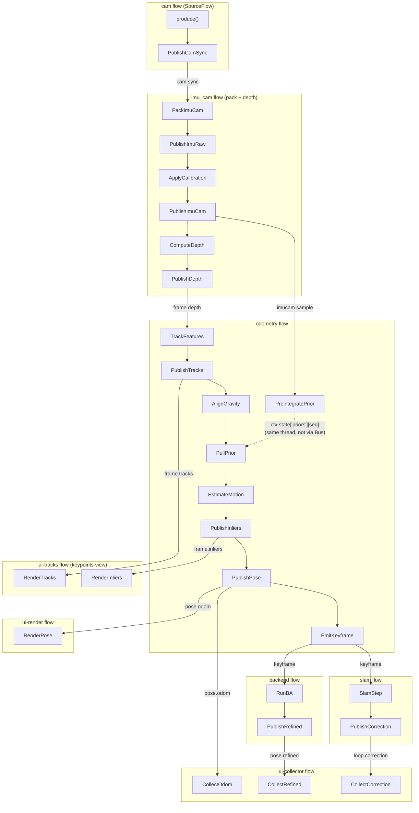

# `ours` — Architecture

From-scratch RGB-D Visual-Inertial Odometry / SLAM for the OAK-D, written to
replace a black-box baseline (DepthAI + Basalt) **one module at a time**. This
tree is **fully standalone**: it imports zero `oakd` / `baseline` code.

> Long-term goal: every block here can be swapped for our own improved
> implementation in isolation. The architecture exists to make that safe.

---

## 1. The two layers

```
ours/
├── lib/      LIBRARIES   — reusable code, no runtime/threads of its own
└── flows/    FLOWS       — the live threaded pipeline that USES the libraries
```

- **`ours.lib`** = pure libraries: algorithms (stereo, odometry, IMU, backend,
  loop) + shared helpers (`misc`) + the **flow-framework library** (`lib/flow`).
  A library has *no behaviour of its own* — it is called, it does not run.
- **`ours.flows`** = the concrete pipeline. Each flow is one thread that wires a
  short chain of tasks using the libraries. Flows hold **no maths**.

Offline tools (`ours.tools.*`) call the `ours.lib` algorithm libraries directly
and never touch `ours.flows`. The flows exist only for the live, threaded run.

---

## 2. HARD RULE — flows communicate ONLY via pub/sub topics

**Flows NEVER call each other directly.** The only way one flow influences
another is by publishing a message on a `Bus` topic the other flow subscribes
to. No flow imports, holds a reference to, or calls a method on another flow.

```python
# produce
ctx.bus.publish(topics.POSE_ODOM, PoseMsg(...))
# consume / forward
self.on(topics.FRAME_DEPTH, [ComputeDepth(), PublishDepth()])
self.forwards_to(topics.POSE_ODOM, topics.KEYFRAME)
```

The **inter-flow contract** is therefore exactly:

- the topic names in `lib/flow/topics.py`, and
- the message types in `lib/flow/messages.py`.

Nothing else couples two flows. The whole pipeline graph is fully described by
*which topics each flow reads and writes*. This is what makes each flow
independently testable and swappable.

> Anti-pattern reminder: do not visualize/record data a module does not actually
> emit. Every UI/recorded stream must trace back to a real output of the system
> being replaced (see project memory `honest-pipeline-visualization`).

---

## 3. The flow framework — `ours.lib.flow`

The threaded, message-passing substrate. It is a *library* (reusable machinery),
so it lives in `lib/` next to the other libraries; the concrete flows import it
just like they import `lib.stereo` or `lib.odometry`.

| Module | Role |
|---|---|
| `flow.py` | `Flow` / `SourceFlow` / `FlowContext` — one thread running a fixed task chain (FIFO or latest-only inbox) |
| `task.py` | `Task` — the smallest input→output step in a chain |
| `pubsub.py` | `Bus` — thread-safe publish/subscribe between flows |
| `messages.py` | one immutable message type per topic (the flow contract) |
| `topics.py` | topic-name constants |
| `runtime.py` | process-wide guards (e.g. `NUMBA_PARALLEL_LOCK`) |

Layering: depends only on the standard library + numpy. It does **not** import
the concrete flows or the algorithm libraries.

### Inbox modes: FIFO vs latest-only
A reactive `Flow` drains an inbox queue on its own thread. `Bus.publish` is
synchronous but only drops the message into the subscriber's inbox, so the heavy
work runs on the *subscribing* flow's thread (actor model) — the publish stays
cheap.

- **FIFO (default):** an unbounded queue, every message processed in order. The
  VIO + deterministic replay require this — dropping a frame would corrupt the
  pose. It is correct as long as the consumer keeps up with the producer.
- **latest-only (`Flow(latest_only=True)`):** a *coalescing* inbox that keeps only
  the newest unprocessed message per topic. A **realtime visualiser** needs this:
  a free-running producer (the live cam paces 20 fps) feeding a FIFO whose
  consumer is even slightly slower (SGM+KLT are serialized by the numba lock, so
  the chain runs < 20 fps) makes the inbox grow **without bound** → the view falls
  seconds behind and keeps drifting. Latest-only drops the backlog so each stage
  always works on the freshest frame; latency is bounded to ~one frame per stage.
  `END` is a control signal and is never coalesced away. The keypoint-depth view
  builds its whole graph latest-only (`build_*(realtime_latest=True)`); the VIO
  and replay never do.

### Numba concurrency guard
`numba parallel=True` is used only in `lib/stereo` (SGM) and
`lib/frontend/klt_numba` (KLT). The default `workqueue` numba layer is **not**
threadsafe across Python threads, so running the depth task (SGM, on the `imu_cam`
thread) and the odometry flow (KLT) concurrently crashes. `runtime.NUMBA_PARALLEL_LOCK` serializes the two
parallel regions; all other flows (pure numpy) run free. `tbb`/`omp` layers are
not installable on this host (macOS arm64, py3.13). Note this lock caps the
cam→imu_cam→odometry chain below the camera frame rate, which is exactly why the
realtime visualiser path needs the latest-only inbox above.

### JIT warmup (live startup)
The SGM + KLT numba kernels are `cache=True`, but on a COLD cache (first run after
a code change) the one-time LLVM compile (~2 s, measured) lands on the first live
frame and stalls the viewer. `lib/misc/warmup.py::warmup_jit` compiles them with tiny
dummy inputs; `app.build_live_frontend` kicks it on a daemon thread at
device-open so the compile overlaps the OAK-D boot + the startup IMU still-window
(dead time anyway). The dispatchers are module singletons, so the warmed
functions are the same ones the frame path calls. It only compiles — never
changes results — and any failure (e.g. numba absent) is swallowed, so frame one
just compiles as before. `warmup_selftest` proves the cold first call drops from
~2000 ms to ~4 ms.

---

## 4. The flows — `ours.flows`

One thread per flow; **one Task per file**; a `*_flow.py` only wires the tasks.

### Topic-level data flow (which flow publishes/subscribes which topic)

```
cam ──cam.sync──► imu_cam ──imucam.sample──► odometry ──pose.odom──► ui-collector, ui-render
                          ──frame.depth─────►          ──frame.tracks─► ui-tracks (keypoints view)
                          ──imu.raw───────► (visualiser) ──frame.inliers─► ui-tracks (keypoints view)
                                                         ──keyframe──► backend, slam
                          (imucam.sample + frame.depth ──► ui-triplet, the image|depth|IMU view)
                                                       backend ──pose.refined──► ui-collector
                                                       slam    ──loop.correction──► ui-collector
```

Edges above are exactly the `self.on(...)` subscriptions in each `*_flow.py`.
There is ONE acquisition front-end (`cam` + `imu_cam`) shared by the VIO
and the visualisers — no separate capture monolith. The in-app visualiser
windows are pure Bus **sinks** built on the same flows: the keypoint-depth view
subscribes `frame.tracks` (`ui-tracks`), the image|depth|IMU triplet subscribes
`frame.depth` + `imucam.sample` joined by seq (`ui-triplet`), and the camera/IMU
view subscribes `imucam.sample` — none runs its own device pipeline. Things worth
noting because the obvious guess is wrong:

- **depth is a task INSIDE the `imu_cam` flow**, not a separate flow: it is just a
  transform of the stereo pair `imu_cam` already produces, so when a matcher is
  wired in (the VIO path) `imu_cam` runs SGM inline and publishes `frame.depth`.
  The visualiser builds `imu_cam` with `matcher=None`, so it skips depth.
- **odometry consumes both `imucam.sample` and `frame.depth`** (both published by
  `imu_cam`); it integrates the packet's gyro into the per-frame rotation prior
  (`PreintegratePrior`) and runs RGB-D PnP against the depth (`EstimateMotion`).
- **the keypoint-depth view subscribes `frame.tracks`** (the odometry frontend's
  real `{id: pixel}` tracks, published by `PublishTracks`) AND `frame.inliers`
  (the RGB-D PnP inlier ids, a separate REAL solve output published by
  `PublishInliers` after `EstimateMotion`); it marks the clean inlier subset with
  a green ring but does NOT run its own frontend — it is a UI sink like ui-render,
  honest about its data source.
- **odometry is a two-input join** (`imucam.sample` + `frame.depth`); it sees an
  END on each before it drains (`expected_ends = 2`).
- **backend and slam both trigger off `keyframe`**, not `pose.odom`. odometry
  emits a keyframe every `kf_every` frames; backend refines it, slam loop-closes.
- **`loop.correction` is consumed only by the UI collector** today — it is *not*
  fed back into odometry, so the live pose path has no closed loop yet. (When
  that feedback is added, give odometry a `self.on(LOOP_CORRECTION, ...)`.)

### Task-level wiring (who receives from whom)



The dotted edge is the one **intra-flow** hand-off: `PreintegratePrior` stashes
the gyro prior for sequence `seq` in the odometry flow's own `ctx.state`, and
`PullPrior` pops it when the matching depth frame arrives. This is shared
state inside a single thread/flow — it does **not** cross the Bus and does **not**
violate the §2 rule (which only forbids *cross-flow* calls).

| Flow | Tasks (in order) | Subscribes | Publishes |
|---|---|---|---|
| **cam** | `produce` → `PublishCamSync` | — (source) | `cam.sync` |
| **imu_cam** | `PackImuCam` → `PublishImuRaw` → `ApplyCalibration` → `PublishImuCam` → `ComputeDepth` → `PublishDepth` | `cam.sync` | `imu.raw`, `imucam.sample`, `frame.depth` |
| **odometry** | `PreintegratePrior` ⟂ `TrackFeatures` → `PublishTracks` → `AlignGravity` → `PullPrior` → `EstimateMotion` → `PublishInliers` → `PublishPose` → `EmitKeyframe` | `imucam.sample`, `frame.depth` | `pose.odom`, `keyframe`, `frame.tracks`, `frame.inliers` |
| **backend** | `RunBA` → `PublishRefined` | `keyframe` | `pose.refined` |
| **slam** | `SlamStep` → `PublishCorrection` | `keyframe` | `loop.correction` |
| **ui-collector** | `CollectOdom` / `CollectRefined` / `CollectCorrection` | `pose.odom`, `pose.refined`, `loop.correction` | — (sink) |
| **ui-render** | `RenderPose` | `pose.odom` | — (sink) |
| **ui-tracks** | `RenderTracks` ⟂ `RenderInliers` | `frame.tracks`, `frame.inliers` | — (sink) |

`cam` + `imu_cam` are the only device-specific flows; their sources are
injected (`ReplayCamSource`/`ReplayImuSource` offline, `LiveCamSource`/
`LiveImuSource` off one shared OAK-D on the bench), so odometry→ui are unchanged on
hardware. The replay path subtracts a startup gyro bias (mean of the first ~1 s)
in `ApplyCalibration` and seeds the odometry gravity-align from the first ~0.3 s
of accel, mirroring what the live front-end measures once at boot.

**Live device safety (host-side).** The OAK-D is single-client: the `cam` and
`imu_cam` live sources share ONE `SharedLiveDevice` pipeline (reference-counted).
Every read of a depthai output queue goes through `SharedLiveDevice.poll`, which
holds the same lock the teardown (`release` → `handle.stop`) holds. So the two
reader threads never enter the depthai link concurrently, and a queue is never
read while another thread is destroying the pipeline — the lifetime race that
aborted the host with `mutex lock failed: Invalid argument` and (by starving the
XLink) tripped the device firmware watchdog. Verified offline by
`oak_live_selftest` (readers hammer `poll` while a concurrent `release` destroys a
queue that raises if read post-stop).

### 4.1 The engine layer — in-process vs out-of-process heavy solve

`backend` and `slam` do not run their solve inline. Each holds an
`ours.lib.engine.Engine` (`ctx.state["engine"]`, also `flow.engine`) and its task
(`RunBA` / `SlamStep`) just `submit`s the keyframe snapshot and `poll`s a result —
the maths lives in the engine, picked by one `worker` flag:

- **`worker=False` (default, OFFLINE)** → `InProcessEngine`: runs the whole solve
  synchronously on the flow thread; `submit`+`poll` happen in the same task
  invocation, so the result is byte-identical to the old in-thread path. The
  replay/scoring path (`run_replay`, `flow_replay_selftest`) **always** uses this —
  determinism + the `pose.refined` count contract (§7) depend on it.
- **`worker=True` (LIVE)** → `SubprocessEngine`: ships each keyframe to a spawned
  process and reads the result back asynchronously. The BA Jacobian assembly / ORB
  / pose-graph solve is mostly pure-Python and would otherwise hold ~17-30 % of the
  read-loop's GIL → dropped frames → the frame-to-frame PnP under-measures fast
  translation → the displayed path stalls / undershoots. Out-of-process removes
  that contention entirely, so the live `ours-ba`/`ours-slam` **marker stays the
  responsive `pose.odom` tip — full distance, exactly like bare `ours`**.

The engine also exposes `poll_overlay()`: a **separate** channel carrying the live
MAP snapshot (BA refined keyframe positions / SLAM corrected keyframe poses + loop
events) so the 3D viewer can draw the refined map BEHIND the marker without
stealing the correction the flow task consumes. `FlowPoseSource` polls it on its
own thread into a lock-guarded mirror; the viewer reads that mirror at 60 Hz.
Parity (in-process == out-of-process, bit-for-bit) is gated by
`ours.tools.engine_parity_selftest`.

### Per-flow files
- `cam/`: `sources.py` (replay/live `CamSource`), `publish_cam_sync.py`,
  `cam_flow.py`.
- `imu_cam/`: `sources.py` (replay/live `ImuSource`), `pack_imucam.py`,
  `apply_calibration.py`, `publish_imu_raw.py`, `publish_imucam.py`,
  `compute_depth.py`, `publish_depth.py` (depth as a task in this flow),
  `imu_stream.py` (IMU-only reader for the calib wizards), `imu_cam_flow.py`.
- `odometry/`: `preintegrate_prior.py`, `track_features.py` (KLT, holds the numba
  parallel lock), `publish_tracks.py` (emits the KLT tracks on `frame.tracks` for
  the keypoints view), `align_gravity.py` (one-shot startup attitude bootstrap),
  `pull_prior.py` (IMU↔vision join: pops the preintegrated prior by seq),
  `estimate_motion.py` (pure-NumPy PnP + gyro fusion, lock-free),
  `publish_inliers.py` (emits the PnP inlier ids on `frame.inliers` for the
  keypoints view to mark the clean subset),
  `tracked.py` (TrackFeatures→PullPrior carrier), `primed.py`
  (PullPrior→EstimateMotion carrier: tracks + joined prior),
  `publish_pose.py`, `emit_keyframe.py`, `step.py` (carrier), `odometry_flow.py`.
- `backend/`: `run_ba.py`, `publish_refined.py`, `backend_flow.py`.
- `slam/`: `slam_step.py`, `publish_correction.py`, `slam_flow.py`.
- `ui/`: `collect_odom.py`, `collect_refined.py`, `collect_correction.py`,
  `collector.py`, `render_pose.py`, `render.py`, `render_tracks.py`,
  `render_inliers.py`, `tracks.py`
  (the keypoint-depth sink: `frame.tracks` + `frame.inliers`), `stash_imucam.py` + `render_triplet.py` + `triplet.py`
  (the image|depth|IMU triplet sink: joins `frame.depth` + `imucam.sample` by seq).

---

## 5. The libraries — `ours.lib`

All 13 subpackages are live (each referenced from ≥5 places — **no dead code**;
the many folders are domain decomposition, not leftovers).

| Package | Contents | What it does |
|---|---|---|
| `frontend/` | corners, klt, klt_numba, frontend | feature detection + KLT tracking |
| `stereo/` | stereo | rectification + SGM dense depth |
| `imu/` | imu, inertial_filter, accel_calib, calib_collect, calib_store, bias_store | gyro preintegration, inertial filter, IMU calibration |
| `odometry/` | odometry, pnp | RGB-D visual odometry |
| `backend/` | bundle, windowed, marginalize, vio_window | windowed bundle adjustment (+ optional Schur marginalization prior) / VIO |
| `loop/` | orb, loopclosure, posegraph, slam | ORB loop closure + pose-graph SLAM |
| `engine/` | base, inprocess, subprocess, steps | swappable runner for the heavy BA/SLAM solve — in-process (offline, deterministic) or **out-of-process** (live, so the solve never holds the read-loop GIL); see §4.1 |
| `io/` | reader, synced | session readers, frame/IMU sync |
| `config/` | resolution | resolution profiles |
| `misc/` | frames, geometry, pose, pngio, warmup | shared `Pose` / frame / geometry / PNG helpers + numba JIT warmup |
| `flow/` | flow, task, pubsub, messages, topics, runtime | the flow framework (see §3) |
| `device/` | oak_live, live_calib | the only hardware corner: open the one shared OAK-D + read boot calibration (depthai imported lazily) |
| `viz/` | depth_render, imucam_render, keypoint_overlay | shared render helpers for the in-app visualiser windows (keypoints / triplet / cam-IMU) |

The stable public API is the flat re-export from `ours/lib/__init__.py`
(`from ours.lib import RGBDVisualOdometry, ORB, SessionReader, ...`).

---

## 6. UI and entry points

- **`ours/app.py`** — live-pipeline assembler. Builds one `Bus`, the six flows,
  starts their threads. Replay harness (validates the flow graph against the same
  data as the offline oracle):
  ```
  python -m ours.app --session sessions/gold/lab_straight_20s --depth-fast
  ```
- **`ours/ui/`** — PyQt6 GUI. `mainwindow.py` (feature menu + 3D viewer),
  `viewer3d.py`, `panels.py`, `calib_dialogs.py` (gyro/accel calib wizards),
  `source.py` (`PoseSource` ABC + `FakePoseSource`), `live_source.py`
  (`FlowPoseSource` bridges the live flow graph → Qt viewer, optical→NED),
  `map_window.py` (the SLAM keyframe point-cloud viewer for `tools/slam_map3d`).
- **`ours/tools/`** — offline scripts that call `ours.lib` directly: per-module
  self-tests (`*_selftest.py`), the `vio_run` oracle, `slam_map3d` (3D room map),
  diagnostics, viewers.

---

## 7. Invariants to keep

1. `ours` imports **zero** `oakd` / `baseline`. Verify:
   ```
   python -c "import ours.app, ours.ui.mainwindow, sys; \
     assert not [m for m in sys.modules if m=='oakd' or m.startswith('oakd.')]"
   ```
2. `depthai` stays **lazy** — importing `ours.lib` / `ours.app` must not import it.
3. **Package-only**: no loose files in `lib/` or `flows/` roots; one Task per file.
4. Flows talk **only** via Bus topics (§2). Libraries never import flows.
5. Offline self-test sweep + replay parity must stay green before committing:
   ```
   for t in orb klt stereo vio_ba ba posegraph imu_preint motion_predict \
            inertial_filter accel_calib calib_store calib_collect \
            imucam_sync flow_replay; do
     python -m ours.tools.${t}_selftest; done
   QT_QPA_PLATFORM=offscreen python -m ours.tools.ui_calib_selftest
   python -m ours.app --session sessions/gold/lab_loop_30s --max-frames 60 --depth-fast
   ```
   Expected replay: 60 `pose.odom` + 10 `pose.refined`. (`flow_replay_selftest`
   now gates this app-graph contract automatically.)

---

## 8. Migration roadmap (replace the black box one block at a time)

The pub/sub contract (§2) is what makes this safe: swap the implementation behind
a flow, keep its topics/messages, and the rest of the graph is unchanged. Each
swap is validated by (a) the module's self-test and (b) replay parity vs the
`vio_run` oracle on the gold sessions.
